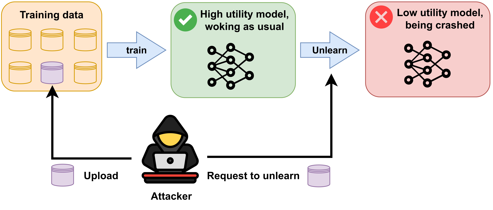

# Unlearning Usability Attack

This is the official implementation of the paper: Releasing Malevolence from Benevolence:
The Menace of Benign Data on Machine Unlearning


## Setup
Please install the dependencies using the following method.

```python
pip install -r requirements.txt
```

# Get Started Quickly
Before attacking machine unlearning, please use the following code to generate informative benign data.
```python
python main.py  --dataset CIFAR100  --model ConvNet  --ipc 1
# --dataset: MNIST, FashionMNIST, CIFAR10, CIFAR100
# --ipc (images/class):10, 20, 30, 40, 50
# --ipc (images/class):1 when CIFAR100
```

Train the model and separately record the parameters contributed by informative benign data and normal data to the model.

```python
python record_train.py --dataset CIFAR100 --test_model ResNet18 --ipc 1
# --test_model: ConvNet, LeNet, AlexNet
```

Unlearning Normal Data
```python
--python unlearn.py  --unlearn_method AmnesiacUnlearn --test_model ResNet18 --dataset CIFAR100  --type normal --ipc 1
```

Unlearning Informative Benign Data
```python
--python unlearn.py  --unlearn_method AmnesiacUnlearn --test_model ResNet18 --dataset CIFAR100  --type infor --ipc 1
```

The code for first-order and second-order methods can be found at https://github.com/alewarne/MachineUnlearning.


